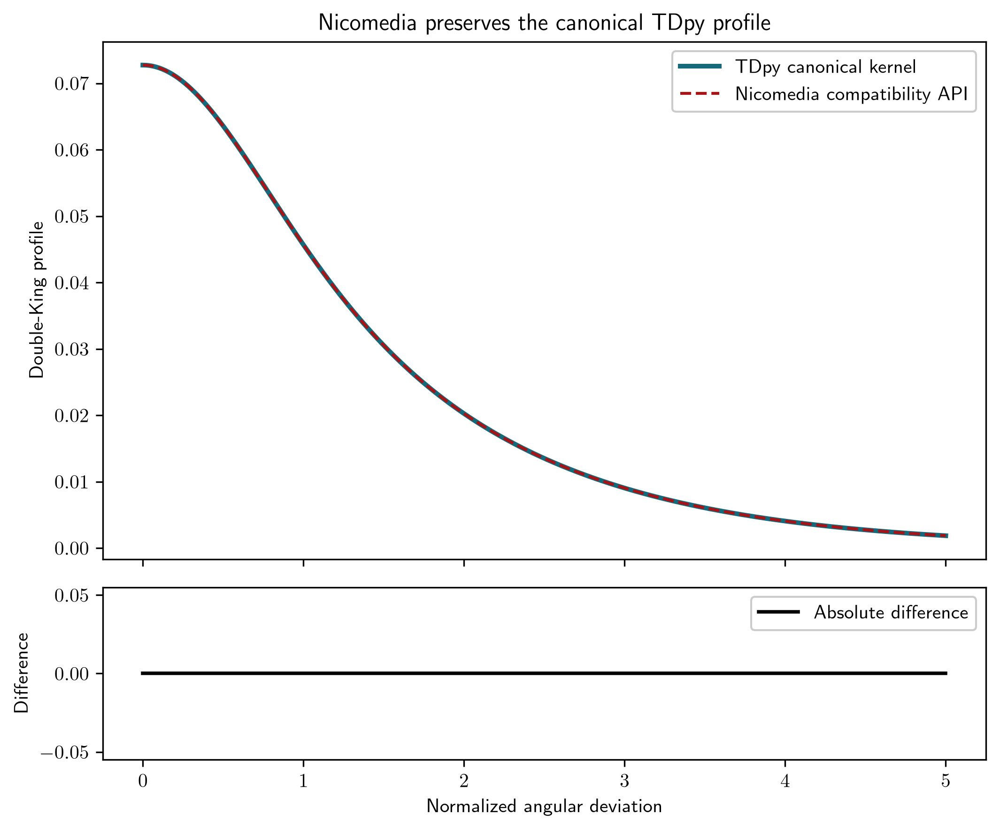

# Nicomedia

Nicomedia is a library for astrophysical routines. It provides utility functions and profile kernels that overlap with the shared functionality in `tdpy`, but it is intentionally treated as a thin compatibility surface rather than as a second source of truth for new numerical implementations.

## Scientific purpose

The package contains numerical building blocks used in astrophysical modeling workflows, especially profile calculations such as King-like and Gaussian-style kernels. These routines are useful in imaging and catalog-related modeling, but they are not meant to be the canonical home for new numerical code in the ecosystem.

## Current status

This repository is best treated as a compatibility wrapper around the canonical shared numerical layer in `tdpy`. For new healthy scientific code, prefer extending the functionality in `tdpy` and then reusing that implementation in ecosystem workflows. Nicomedia should remain lightweight and clear about its role as a compatibility helper rather than as an independent numerical library.

## Relationship to the wider ecosystem

- canonical utility layer: `tdpy`
- compatibility wrapper: `nicomedia`
- decision: keep only when a minimal wrapper or workflow-specific convenience layer is justified; otherwise prefer merging or retiring redundant code in favor of `tdpy`

## Installation

```bash
cd nicomedia
python -m pip install -e .
export NICOMEDIA_PATH=/path/to/nicomedia
```

`NICOMEDIA_PATH` identifies the repository root. Keep runtime inputs in `data/` and generated pipeline outputs in `visuals/`; both directories are ignored by Git.

## Minimal workflow

A runnable compatibility example evaluates the same analytic double-King profile through Nicomedia and TDpy:

```bash
python examples/double_king_compatibility.py --typefileplot png
```



The upper panel shows the shared analytic profile for explicit kernel parameters. The lower panel shows the absolute numerical difference. It is exactly zero, demonstrating that Nicomedia preserves the TDpy implementation rather than maintaining a redundant kernel.

## Dependencies

The package sits on the standard scientific stack and relies primarily on the shared ecosystem utilities provided by `tdpy`.

## Development status

This repository remains valuable as a compatibility layer and a place to preserve historical implementations where a direct migration to `tdpy` is not yet justified. New scientific code should not be added here unless there is a clear, documented reason to keep it separate.
