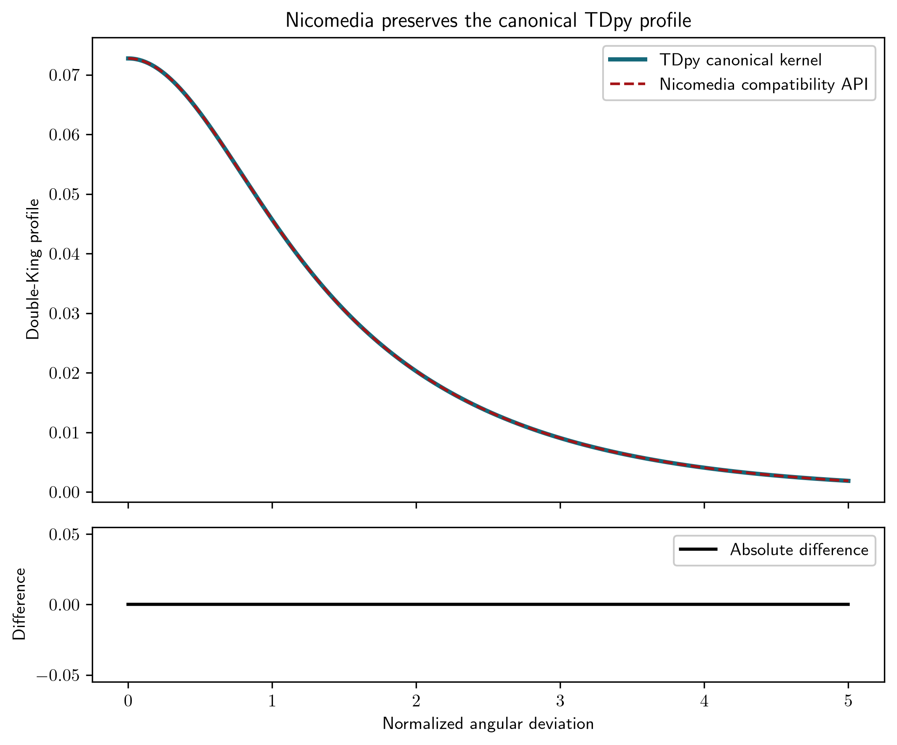

# Nicomedia

Nicomedia provides utility functions and analytic profile kernels for astrophysical imaging and catalog modeling. Users can evaluate King-like and Gaussian point-spread profiles through a stable interface and apply them to scalar or array-valued coordinates.

## Installation

```bash
cd nicomedia
python -m pip install -e .
export NICOMEDIA_PATH=/path/to/nicomedia
```

`NICOMEDIA_PATH` identifies the repository root. Keep runtime inputs in `data/` and generated pipeline outputs in `visuals/`; both directories are ignored by Git.

## Minimal workflow

A runnable compatibility example evaluates the same analytic double-King profile through Nicomedia and TDpy:

```bash
python examples/double_king_compatibility.py --typefileplot png
```



The upper panel shows the shared analytic profile for explicit kernel parameters. The lower panel shows the absolute numerical difference. It is exactly zero, demonstrating that Nicomedia preserves the TDpy implementation rather than maintaining a redundant kernel.

## Dependencies

Nicomedia uses NumPy for array calculations and TDpy for tested numerical and plotting utilities.
